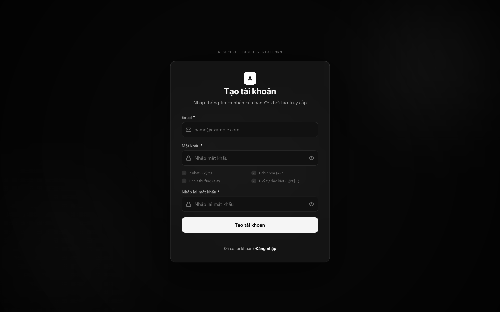
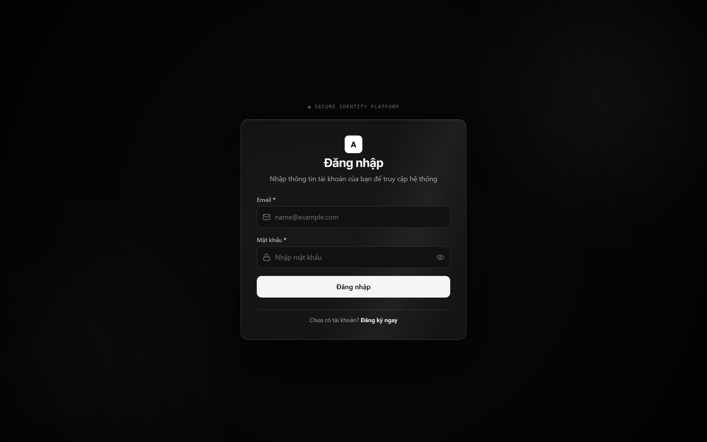
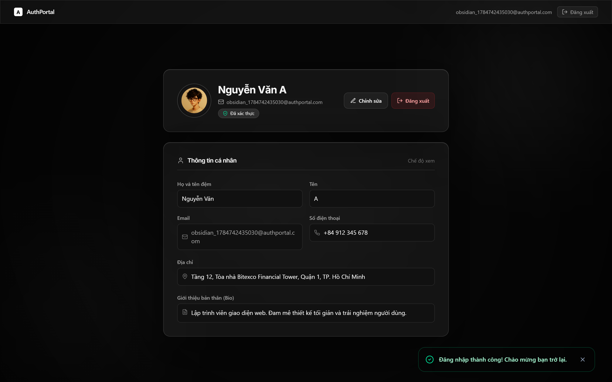

# AuthPortal

> Ứng dụng **Đăng ký – Đăng nhập – Hồ sơ người dùng** sử dụng Firebase, được xây dựng bằng React và Vite với giao diện **Liquid Obsidian Glass**: nền WebGL dạng chất lỏng, hiệu ứng gợn nước theo con trỏ, glassmorphism có kiểm soát và chuyển động UX tinh tế.

<p align="center">
  
  
  
  
  
</p>

## Liên kết

- **Repository:** <https://github.com/anhduyalpha/Login-Page>
- **Production:** cập nhật URL Vercel sau khi deployment hoàn tất
- **Tài liệu kỹ năng AI:** [`Skill.md`](./Skill.md)
- **Tài liệu thiết kế:** [`docs/DESIGN_IMPLEMENTATION.md`](./docs/DESIGN_IMPLEMENTATION.md)

---

## 1. Tổng quan

AuthPortal là website xác thực người dùng tập trung vào ba luồng chính:

1. **Đăng ký tài khoản** bằng email và mật khẩu.
2. **Đăng nhập** bằng Firebase Authentication.
3. **Xem và chỉnh sửa hồ sơ** được lưu tại Cloud Firestore.

Ứng dụng không có landing page, marketing dashboard hay số liệu giả. Toàn bộ trải nghiệm tập trung vào form xác thực, trạng thái lỗi/thành công và quản lý hồ sơ cá nhân.

### Luồng sử dụng

```text
Đăng ký
  → Firebase Authentication tạo tài khoản
  → Firestore tạo users/{uid}
  → Hiển thị chính xác "Successfully"
  → Đăng xuất tài khoản vừa tạo
  → Chuyển sang Đăng nhập
  → Đăng nhập thành công
  → Mở Hồ sơ
  → Chỉnh sửa và lưu lại Firestore
  → Đăng xuất
```

---

## 2. Chức năng chính

### Đăng ký

- Kiểm tra email bắt buộc và đúng định dạng.
- Mật khẩu tối thiểu 8 ký tự.
- Bắt buộc có ít nhất:
  - 1 chữ hoa;
  - 1 chữ thường;
  - 1 ký tự đặc biệt.
- Confirm Password phải trùng với mật khẩu.
- Hiển thị yêu cầu mật khẩu theo thời gian thực.
- Chặn submit lặp trong lúc xử lý.
- Tạo tài khoản bằng `createUserWithEmailAndPassword`.
- Tạo hồ sơ tại `users/{uid}` trong Firestore.
- Rollback tài khoản Authentication nếu ghi hồ sơ Firestore thất bại.
- Chỉ hiển thị `Successfully` sau khi cả Auth và Firestore đều thành công.
- Tự động đăng xuất và chuyển sang màn hình đăng nhập.

### Đăng nhập

- Xác thực email và mật khẩu.
- Đăng nhập bằng `signInWithEmailAndPassword`.
- Dịch mã lỗi Firebase thành thông báo tiếng Việt dễ hiểu.
- Tải hồ sơ Firestore sau khi Authentication xác nhận người dùng.
- Không dùng `localStorage` làm hệ thống xác thực dự phòng.
- Chuyển sang màn hình Profile sau khi đăng nhập thành công.

### Hồ sơ người dùng

- Hiển thị avatar chữ cái đại diện.
- Hiển thị email từ Firebase Authentication.
- Hiển thị và chỉnh sửa:
  - họ;
  - tên;
  - tên hiển thị;
  - số điện thoại;
  - địa chỉ;
  - tiểu sử.
- Lưu thay đổi vào `users/{uid}`.
- Đồng bộ `displayName` với Firebase Authentication khi phù hợp.
- Dữ liệu được giữ lại sau khi refresh.
- Có trạng thái đang lưu, thành công và lỗi.
- Đăng xuất và quay lại màn hình Login.

---

## 3. Thiết kế giao diện

### Liquid Obsidian Glass

Thiết kế hiện tại sử dụng phong cách đơn sắc đen–trắng với chiều sâu kính và chất lỏng:

- nền WebGL toàn màn hình;
- nhiễu bề mặt tần số thấp tạo chuyển động nước nhẹ;
- biến dạng cục bộ theo vị trí và vận tốc con trỏ;
- gợn nước khi click hoặc tap;
- khúc xạ các lớp sáng graphite phía sau;
- viền kính, highlight và shadow có kiểm soát;
- panel form ổn định, không bị shader làm méo;
- chuyển màn hình bằng Framer Motion;
- hỗ trợ `prefers-reduced-motion`;
- fallback tĩnh khi WebGL không hoạt động.

### Nguyên tắc UX

- Form luôn là điểm tập trung chính.
- Hiệu ứng nền không chặn thao tác người dùng.
- Không dùng neon, particle hoặc chuyển động liên tục gây mất tập trung.
- Focus state rõ ràng cho bàn phím.
- Error/success được thông báo bằng văn bản, icon và màu sắc.
- Touch target tối thiểu khoảng 44 px.
- Mobile giảm độ phức tạp shader để giữ hiệu năng.

---

## 4. Công nghệ sử dụng

| Nhóm | Công nghệ |
|---|---|
| Frontend | React 19, JSX |
| Build tool | Vite 6 |
| Styling | Tailwind CSS v4, CSS tùy chỉnh |
| Motion | Framer Motion |
| Icons | Lucide React |
| Authentication | Firebase Authentication |
| Database | Cloud Firestore |
| Visual effect | WebGL fragment shader |
| Unit test | Vitest |
| Browser automation | Puppeteer |
| Lint | ESLint |
| Deployment | Vercel |

---

## 5. Cấu trúc dự án

```text
Login-Page/
├── docs/
│   ├── screenshots/
│   └── DESIGN_IMPLEMENTATION.md
├── scripts/
│   ├── capture_screenshots.js
│   └── verify_firebase_emulator.mjs
├── src/
│   ├── components/
│   │   ├── AuthLayout.jsx
│   │   ├── LiquidGlassBackground.jsx
│   │   └── NotificationToast.jsx
│   ├── context/
│   │   └── AuthContext.jsx
│   ├── pages/
│   │   ├── RegisterPage.jsx
│   │   ├── LoginPage.jsx
│   │   └── ProfilePage.jsx
│   ├── services/
│   │   └── firebase.js
│   ├── styles/
│   │   └── index.css
│   ├── App.jsx
│   └── main.jsx
├── .env.example
├── .gitignore
├── firebase.json
├── firestore.indexes.json
├── firestore.rules
├── package.json
├── Skill.md
├── vite.config.js
└── README.md
```

> Cấu trúc trên mô tả các thành phần chính. Một số file hỗ trợ hoặc test có thể được bổ sung trong quá trình phát triển.

---

## 6. Yêu cầu hệ thống

- Node.js 18 trở lên.
- npm 9 trở lên.
- Một Firebase project có Web App.
- Email/Password Authentication đã được bật.
- Cloud Firestore đã được tạo.

Kiểm tra phiên bản:

```bash
node --version
npm --version
```

---

## 7. Cài đặt và chạy local

### Bước 1: Clone repository

```bash
git clone https://github.com/anhduyalpha/Login-Page.git
cd Login-Page
```

### Bước 2: Cài dependency

```bash
npm install
```

### Bước 3: Tạo file môi trường

PowerShell:

```powershell
Copy-Item .env.example .env.local
```

CMD:

```cmd
copy .env.example .env.local
```

Điền cấu hình Firebase thật vào `.env.local`:

```env
VITE_FIREBASE_API_KEY=your_api_key
VITE_FIREBASE_AUTH_DOMAIN=your_project.firebaseapp.com
VITE_FIREBASE_PROJECT_ID=your_project_id
VITE_FIREBASE_STORAGE_BUCKET=your_project.firebasestorage.app
VITE_FIREBASE_MESSAGING_SENDER_ID=your_sender_id
VITE_FIREBASE_APP_ID=your_app_id

# Tùy chọn
VITE_FIREBASE_MEASUREMENT_ID=
```

Không bật emulator trong bản production:

```env
VITE_FIREBASE_USE_EMULATOR=false
```

### Bước 4: Chạy development server

```bash
npm run dev
```

Ứng dụng mặc định chạy tại:

```text
http://localhost:3000
```

---

## 8. Lấy cấu hình Firebase

Trong Firebase Console:

```text
Project settings
→ General
→ Your apps
→ chọn Web App </>
→ SDK setup and configuration
→ Config
```

Firebase sẽ cung cấp:

```js
const firebaseConfig = {
  apiKey: "...",
  authDomain: "...",
  projectId: "...",
  storageBucket: "...",
  messagingSenderId: "...",
  appId: "..."
};
```

Ánh xạ các giá trị sang biến Vite:

| Firebase config | Biến môi trường |
|---|---|
| `apiKey` | `VITE_FIREBASE_API_KEY` |
| `authDomain` | `VITE_FIREBASE_AUTH_DOMAIN` |
| `projectId` | `VITE_FIREBASE_PROJECT_ID` |
| `storageBucket` | `VITE_FIREBASE_STORAGE_BUCKET` |
| `messagingSenderId` | `VITE_FIREBASE_MESSAGING_SENDER_ID` |
| `appId` | `VITE_FIREBASE_APP_ID` |
| `measurementId` | `VITE_FIREBASE_MEASUREMENT_ID` — tùy chọn |

### Bật Email/Password Authentication

```text
Firebase Console
→ Authentication
→ Sign-in method
→ Email/Password
→ Enable
→ Save
```

### Tạo Cloud Firestore

```text
Firebase Console
→ Firestore Database
→ Create database
```

Sau khi đăng ký thành công, dữ liệu người dùng được tạo tại:

```text
users/{uid}
```

---

## 9. Cấu trúc dữ liệu Firestore

Ví dụ tài liệu người dùng:

```js
{
  uid: "firebase-auth-uid",
  email: "user@example.com",
  displayName: "user",
  firstName: "",
  lastName: "",
  phone: "",
  address: "",
  bio: "",
  createdAt: "ISO timestamp",
  updatedAt: "ISO timestamp"
}
```

Ứng dụng không lưu các dữ liệu sau trong Firestore:

- mật khẩu;
- confirm password;
- Firebase access token;
- GitHub token;
- private key;
- service-account credential.

---

## 10. Firestore Security Rules

Rules hiện tại giới hạn quyền truy cập theo Firebase Auth UID:

- người dùng chỉ được đọc hồ sơ của chính mình;
- chỉ được tạo tài liệu `users/{uid}` trùng với UID đăng nhập;
- email trong tài liệu phải khớp email Authentication khi tạo;
- không được thay đổi `uid` hoặc `email` khi cập nhật;
- tất cả collection khác bị từ chối mặc định.

Deploy rules:

```bash
firebase login
firebase use YOUR_FIREBASE_PROJECT_ID
firebase deploy --only firestore:rules
```

Không deploy rules vào một Firebase project không thuộc dự án này.

---

## 11. Các lệnh phát triển

| Lệnh | Chức năng |
|---|---|
| `npm run dev` | Chạy Vite development server tại port 3000 |
| `npm run build` | Tạo production bundle trong `dist/` |
| `npm run preview` | Xem thử production build |
| `npm run lint` | Kiểm tra code bằng ESLint |
| `npm run test` | Chạy test bằng Vitest |
| `npm run test:watch` | Chạy Vitest ở chế độ watch |
| `npm run verify:firebase` | Chạy kiểm tra Firebase bằng Emulator Suite |
| `npm run capture-screenshots` | Chụp ảnh giao diện bằng Puppeteer |

Chạy kiểm tra cơ bản trước khi commit:

```bash
npm run lint
npm run test
npm run build
```

---

## 12. Firebase Emulator Suite

Emulator chỉ dành cho phát triển và kiểm thử local.

Các port mặc định:

| Dịch vụ | Port |
|---|---:|
| Authentication Emulator | 9099 |
| Firestore Emulator | 8080 |

Chạy bộ xác minh:

```bash
npm run verify:firebase
```

Không thêm các biến emulator sau lên Vercel Production:

```env
VITE_FIREBASE_USE_EMULATOR=true
VITE_FIREBASE_AUTH_EMULATOR_URL=http://127.0.0.1:9099
VITE_FIREBASE_FIRESTORE_EMULATOR_HOST=127.0.0.1
VITE_FIREBASE_FIRESTORE_EMULATOR_PORT=8080
```

---

## 13. Build production

```bash
npm run build
npm run preview
```

Output production nằm tại:

```text
dist/
```

`dist/` không được commit lên GitHub.

---

## 14. Deploy lên Vercel

### Import GitHub repository

```text
Vercel Dashboard
→ Add New
→ Project
→ Import anhduyalpha/Login-Page
```

Cấu hình build:

| Thiết lập | Giá trị |
|---|---|
| Framework Preset | Vite |
| Root Directory | `./` |
| Install Command | `npm install` |
| Build Command | `npm run build` |
| Output Directory | `dist` |

### Thêm Environment Variables

Trong:

```text
Project Settings
→ Environment Variables
```

Thêm đủ:

```text
VITE_FIREBASE_API_KEY
VITE_FIREBASE_AUTH_DOMAIN
VITE_FIREBASE_PROJECT_ID
VITE_FIREBASE_STORAGE_BUCKET
VITE_FIREBASE_MESSAGING_SENDER_ID
VITE_FIREBASE_APP_ID
```

Áp dụng cho:

```text
Production
Preview
Development
```

Sau khi thêm hoặc sửa biến môi trường:

```text
Deployments
→ deployment mới nhất
→ Redeploy
```

Nếu thiếu một trong sáu biến bắt buộc, ứng dụng chủ động dừng khởi tạo thay vì chuyển sang hệ thống xác thực giả. Trên giao diện nền tối, lỗi này có thể biểu hiện thành trang đen; hãy kiểm tra tab Console của trình duyệt.

---

## 15. Kiểm thử thủ công

### Register

- Submit form rỗng.
- Email sai định dạng.
- Mật khẩu ngắn hơn 8 ký tự.
- Thiếu chữ hoa.
- Thiếu chữ thường.
- Thiếu ký tự đặc biệt.
- Confirm Password không khớp.
- Email đã được sử dụng.
- Đăng ký thành công.
- Xác nhận `Successfully` xuất hiện.
- Xác nhận người dùng được tạo trong Firebase Authentication.
- Xác nhận `users/{uid}` được tạo trong Firestore.
- Xác nhận tự đăng xuất và chuyển sang Login.

### Login

- Email hoặc mật khẩu không hợp lệ.
- Sai thông tin đăng nhập.
- Đăng nhập thành công.
- Hồ sơ được tải từ Firestore.

### Profile

- Xem thông tin hiện tại.
- Mở Edit mode.
- Lưu thay đổi.
- Refresh và kiểm tra dữ liệu vẫn còn.
- Đăng xuất.

### UI/UX

- Desktop: 1440 px và 1024 px.
- Tablet: 768 px.
- Mobile: 375 px và 320 px.
- Keyboard navigation.
- Focus states.
- Reduced motion.
- WebGL fallback.
- Console không có lỗi blocking.

---

## 16. Screenshots

Ảnh giao diện được lưu trong [`docs/screenshots`](./docs/screenshots/).

| Register | Login | Profile |
|---|---|---|
|  |  |  |

Một số trạng thái bổ sung:

- [`register-field-focus.png`](./docs/screenshots/register-field-focus.png)
- [`register-validation.png`](./docs/screenshots/register-validation.png)
- [`register-loading.png`](./docs/screenshots/register-loading.png)
- [`register-success.png`](./docs/screenshots/register-success.png)
- [`login-error.png`](./docs/screenshots/login-error.png)
- [`profile-edit.png`](./docs/screenshots/profile-edit.png)
- [`profile-save-success.png`](./docs/screenshots/profile-save-success.png)
- [`register-mobile.png`](./docs/screenshots/register-mobile.png)
- [`login-mobile.png`](./docs/screenshots/login-mobile.png)
- [`profile-mobile.png`](./docs/screenshots/profile-mobile.png)

---

## 17. Bảo mật

- Không commit `.env` hoặc `.env.local`.
- Không đưa service-account JSON lên frontend.
- Không lưu mật khẩu trong Firestore hoặc localStorage.
- Không gửi GitHub Personal Access Token vào source code.
- Firebase Web config được dùng để nhận diện project, nhưng quyền dữ liệu phải được bảo vệ bằng Authentication và Firestore Rules.
- Production không tự động fallback sang dữ liệu giả khi Firebase lỗi.
- Firestore profile chỉ được truy cập bởi đúng UID sở hữu.

Các file đã được `.gitignore`:

```text
.env
.env.local
.env*.local
node_modules/
dist/
.firebase/
coverage/
test-results/
playwright-report/
```

---

## 18. Accessibility và hiệu năng

### Accessibility

- Semantic HTML và label rõ ràng.
- Password toggle có `aria-label`.
- Toast và lỗi form có thông báo trạng thái.
- Focus ring tương phản cao.
- Không truyền đạt trạng thái chỉ bằng màu sắc.
- Hỗ trợ `prefers-reduced-motion`.
- Có fallback nền tĩnh khi WebGL không khả dụng.

### Hiệu năng Liquid Glass

- Chỉ sử dụng một WebGL canvas toàn màn hình.
- Giới hạn device pixel ratio.
- Giảm độ phức tạp shader trên mobile.
- Không cập nhật React state ở mỗi animation frame.
- Tạm dừng vòng lặp khi tab bị ẩn.
- Giới hạn số ripple hoạt động đồng thời.
- Dọn event listener và WebGL context khi unmount.

---

## 19. Hạn chế hiện tại

- Ứng dụng hiện chuyển Register, Login và Profile bằng state nội bộ thay vì URL route riêng như `/register`, `/login`, `/profile`.
- Chưa có chức năng quên mật khẩu hoặc xác minh email.
- Chưa hỗ trợ đăng nhập Google hoặc nhà cung cấp OAuth khác.
- Chưa có upload ảnh avatar lên Firebase Storage.
- Hiệu ứng WebGL có thể bị giảm hoặc chuyển sang fallback trên thiết bị yếu.
- URL production Vercel chưa được ghi cố định trong README.

---

## 20. Thành viên nhóm

| Thành viên | Vai trò | Công việc |
|---|---|---|
| Nguyễn Anh Duy | Frontend / Firebase / Documentation | Cập nhật nội dung theo phân công thực tế |
| Thành viên 2 | — | — |
| Thành viên 3 | — | — |

Cập nhật bảng này trước khi nộp bài để phản ánh đúng đóng góp của từng thành viên.

---

## 21. Công cụ AI và kỹ năng đã sử dụng

Dự án có sử dụng AI hỗ trợ trong quá trình phân tích, thiết kế, triển khai và kiểm thử:

- Google Antigravity;
- `ui-ux-pro-max`;
- `design-taste-frontend`;
- Firebase MCP;
- GitHub MCP;
- Browser/Chrome DevTools automation.

Chi tiết về cách dùng, giới hạn và phần kiểm tra của con người được ghi tại [`Skill.md`](./Skill.md).

AI được dùng như công cụ hỗ trợ. Nhóm vẫn chịu trách nhiệm kiểm tra source code, Firebase configuration, security rules, kết quả test và sản phẩm cuối cùng.

---

## 22. Quy trình đóng góp

```bash
git checkout -b feature/ten-tinh-nang
# chỉnh sửa code
npm run lint
npm run test
npm run build
git add .
git commit -m "feat: mô tả thay đổi"
git push -u origin feature/ten-tinh-nang
```

Không commit secret, file môi trường hoặc test credential.

---

## 23. Giấy phép và mục đích sử dụng

Dự án được xây dựng phục vụ mục đích học tập và bài tập nhóm. Không sử dụng thông tin người dùng thật hoặc dữ liệu nhạy cảm trong môi trường kiểm thử.

© 2026 AuthPortal Team.
