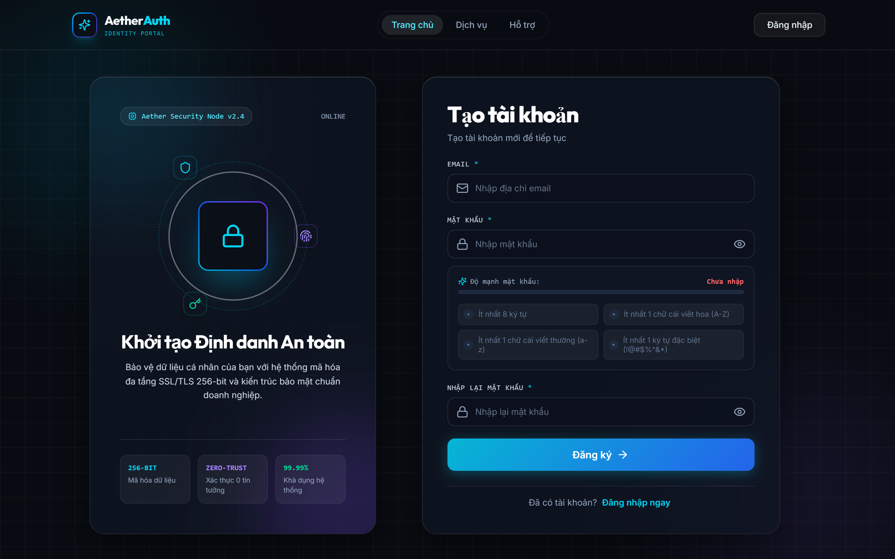
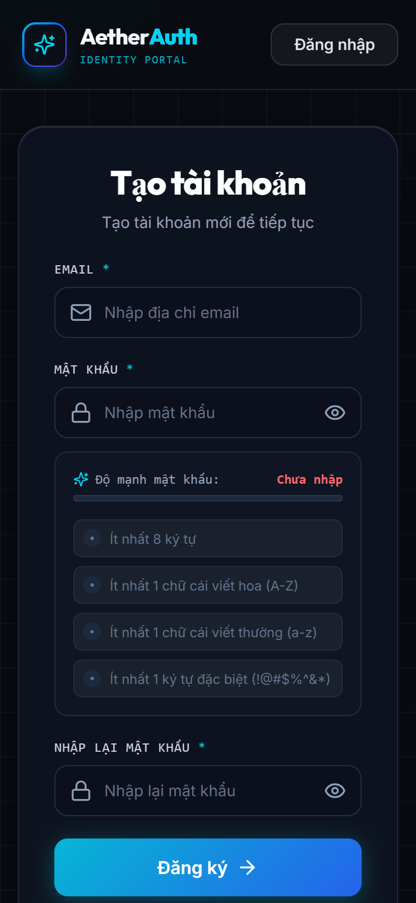
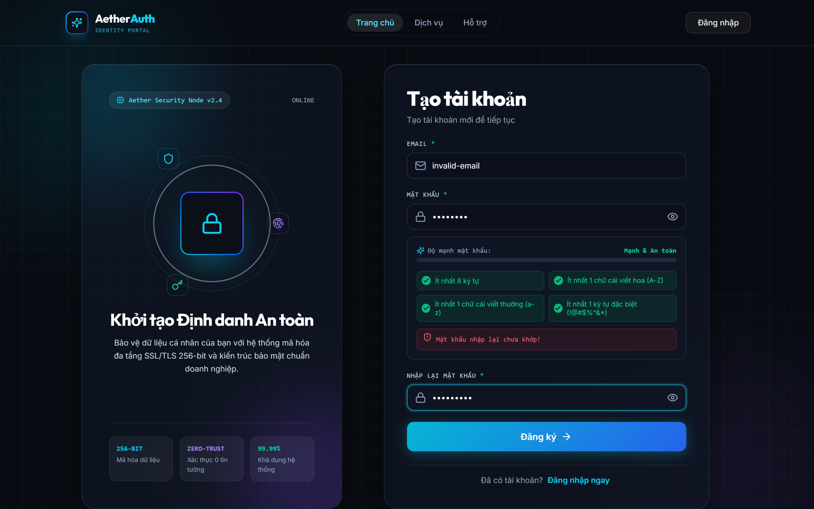
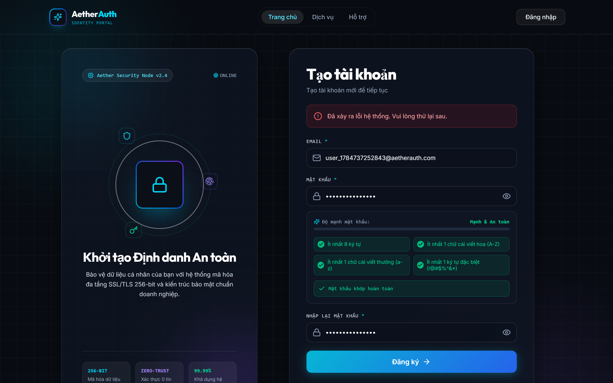
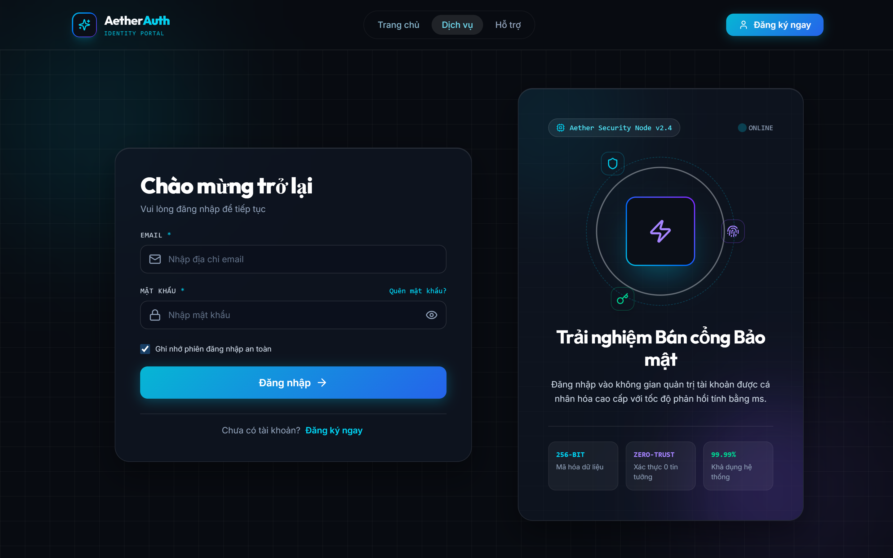
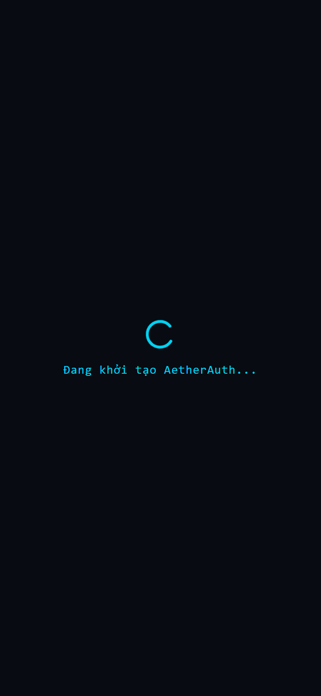
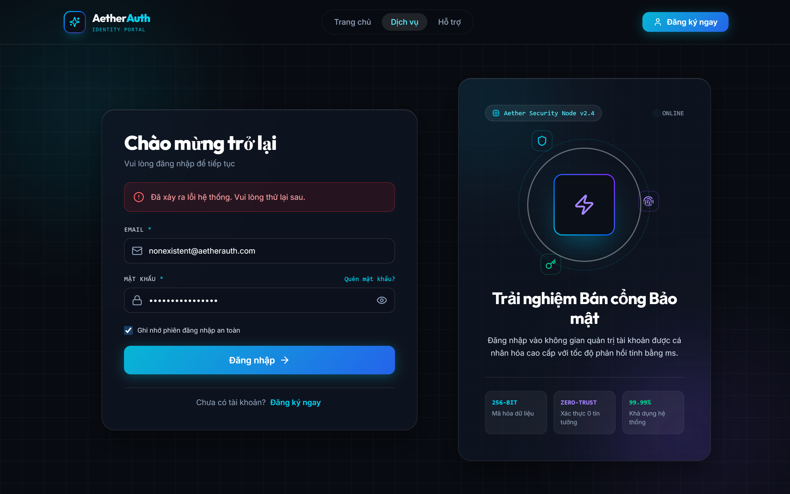
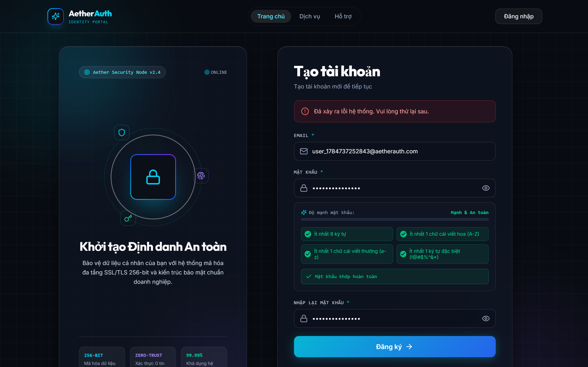
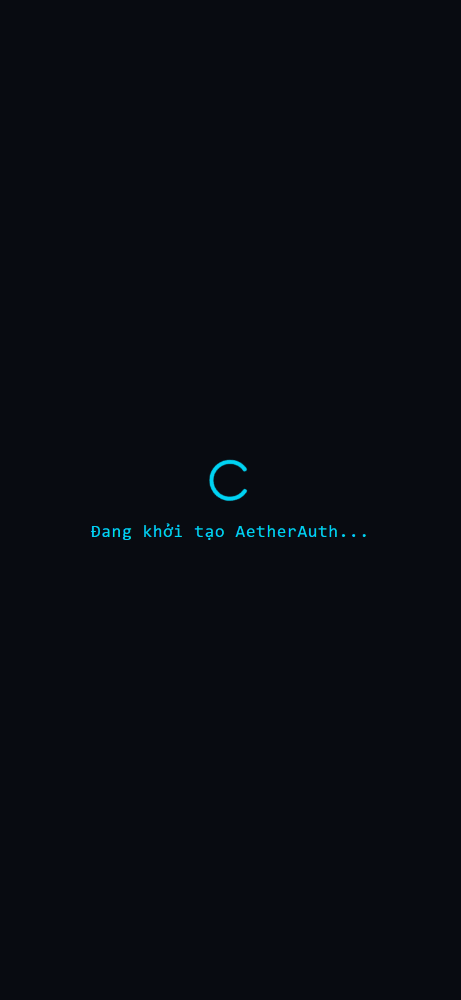
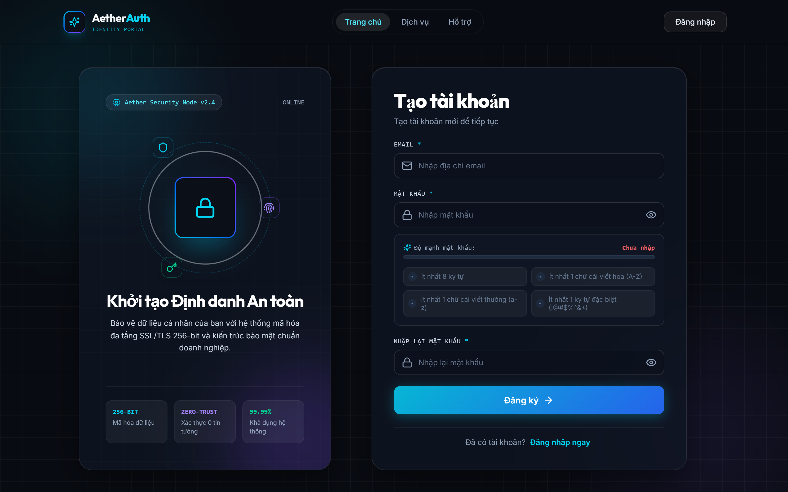

# AetherAuth — Next-Gen Identity & Access Management Portal

> **Organizer Disclaimer**: The organizers allowed teams to creatively enhance and redesign the supplied interface. The design files were used as functional references, while the final UI was independently art-directed and implemented by the team.


AetherAuth is a high-grade, security-focused identity management experience featuring a Cyber-Luxe obsidian design system, real-time password security validation, animated success state, interactive profile completion meter, and full Firebase authentication integration with fallback demo support.

---

## 🌟 Key Features

### 1. Register Experience
- **Asymmetric Split-Screen**: Dual-panel layout combining an interactive Identity Sphere visual motif with an onboarding card.
- **Live 4-Point Password Validator**: Real-time evaluation for length (8+ chars), uppercase, lowercase, special characters, and confirm password match.
- **Exact Success State**: Polished confirmation modal displaying the mandatory exact string **`Successfully`**, celebration confetti, and auto-redirect progress bar.

### 2. Login Experience
- **Returning User Flow**: Email and password fields with password visibility toggle.
- **Security Options**: "Remember Me" session persistence and interactive "Forgot Password?" recovery dialog.
- **Friendly Firebase Error Mapping**: Human-readable error messages for all Firebase authentication error codes (`auth/wrong-password`, `auth/user-not-found`, etc.).

### 3. Profile Identity Dashboard
- **Hero Profile Card**: Custom avatar initial generator, Display Name (`baochinhvus`), Email, and "Tài khoản đã xác thực" verified badge.
- **Dynamic Completion Meter**: Real-time calculated completion score based on filled fields:
  - Họ và tên đệm: 25%
  - Tên: 25%
  - Số điện thoại: 25%
  - Địa chỉ: 25%
- **Seamless View / Edit Mode**: Smooth transition between static view and editable form fields with Save, Cancel, and Firebase profile sync.

---

## 🛠️ Technology Stack

- **Core**: React 19, JavaScript (ES6+), HTML5, Vite 6
- **Styling**: Custom CSS Tokens, Glassmorphism, Tailwind CSS, Google Fonts (Outfit, Inter, JetBrains Mono)
- **Icons & Effects**: Lucide React Icons, Canvas Confetti
- **Authentication**: Firebase Authentication SDK + In-Memory Local Demo Engine Fallback
- **Automation & Testing**: Puppeteer Screenshot Capture Pipeline

---

## 🚀 Quick Start Guide

### Prerequisites
- Node.js (v18+)
- npm (v9+)

### Installation & Development

```bash
# 1. Clone or navigate to directory
cd Login-Page

# 2. Install dependencies
npm install

# 3. Start local dev server
npm run dev
```

Visit `http://localhost:3000` to interact with the live portal.

### Build & Production Preview

```bash
# Build production bundle
npm run build

# Preview build locally
npm run preview
```

### Automated Screenshot Capture

To regenerate all 10 required PNG screenshots into `docs/screenshots/`:

```bash
# Start dev server in one terminal:
npm run dev

# Run capture pipeline in second terminal:
npm run capture-screenshots
```

---

## 📸 Interface Screenshots Gallery

| Screen | Preview |
|---|---|
| **Register Desktop** |  |
| **Register Mobile** |  |
| **Password Validation** |  |
| **Registration Success (`Successfully`)** |  |
| **Login Desktop** |  |
| **Login Mobile** |  |
| **Login Error State** |  |
| **Profile Dashboard View** |  |
| **Profile Mobile View** |  |
| **Profile Edit Mode** |  |

---

## 📄 Documentation

For full details on the design exploration, concept benchmarking, token architecture, motion timing, and accessibility compliance, see [docs/DESIGN_IMPLEMENTATION.md](docs/DESIGN_IMPLEMENTATION.md).
